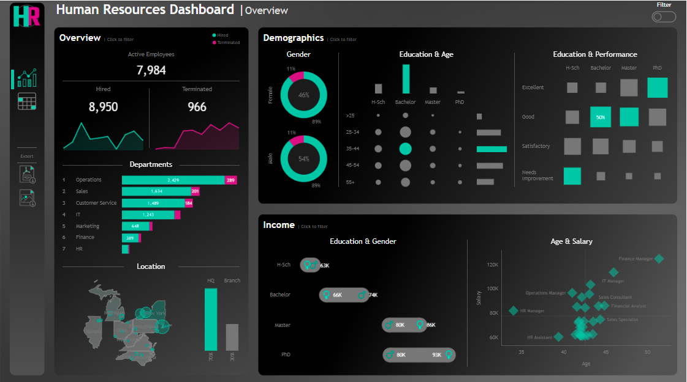

# 📊 Human Resources (HR) Analytics Dashboard — Tableau End-to-End Project


Proyek Business Intelligence interaktif end-to-end yang dirancang untuk memberikan visibilitas menyeluruh terhadap dinamika tenaga kerja korporat (*Workforce Demographics, Retention & Attrition, Divisional Turnover, and Compensation Equity*).

Proyek ini dibangun mengadopsi standar industri dan kerangka kerja profesional dari video tutorial terkemuka:  
🎬 **["Complete HR Tableau Project End-to-End | Like I Do in My Real Projects"](https://www.youtube.com/watch?v=UcGF09Awm4Y)** oleh **Data With Baraa (Baraa Khatib Salkini)**.

---

## 🖼️ Tampilan Dasbor (Executive Overview)



---

## 🎯 Objektif & Kebutuhan Bisnis (User Stories)

1. **Executive Management (C-Suite & HR Director)**:
   - Memantau metrik kesehatan SDM secara *real-time*: Total Headcount yang direkrut, Karyawan Aktif, dan Total Terminasi.
   - Mengidentifikasi pola musiman penerimaan dan pemutusan hubungan kerja dari tahun ke tahun (tren tahun 2015–2023).
   - Mengetahui departemen dengan risiko *turnover* tertinggi untuk mitigasi proaktif.

2. **HR Operations & People Analytics Specialist**:
   - Memeriksa kesetaraan kompensasi antar gender (*Gender Pay Equity*) dan antar jenjang pendidikan (*High School, Bachelor, Master, PhD*).
   - Menganalisis korelasi antara usia, jabatan kerja, dan rentang kompensasi gaji (*Scatter Plot Distribution*).
   - Mengakses direktori data granular (*HR Details*) yang dapat difilter berdasarkan divisi, jabatan, wilayah, dan status kerja, dengan kemampuan ekspor instan ke format PDF dan Gambar.

---

## 🏛️ Arsitektur Dasbor (Dual-Perspective BI)

Dasbor ini dirancang dengan pendekatan dua halaman modular yang terhubung melalui tombol navigasi interaktif:

### 1. Dasbor Ringkasan Eksekutif (`HR | Summary`)
- **KPI BANs (Big-Ass Numbers)**:
  - **8.950** Total Hired (Karyawan yang pernah direkrut)
  - **7.984** Active Employees (Karyawan aktif saat ini)
  - **966** Terminated Employees (10.8% Turnover Rate / 89.2% Retention Rate)
- **Tren Tahunan (2015 - 2023)**:
  - *Sparkline* penerimaan karyawan (Hired by Year).
  - *Sparkline* terminasi karyawan (Terminated by Year).
- **Demografi & Keberagaman**:
  - *Donut Chart* rasio gender (54% Pria vs 46% Wanita).
  - Matriks sebaran kelompok usia (`<25`, `25-34`, `35-44`, `45-54`, `55+`) per jenjang pendidikan.
  - *Heatmap Matrix* korelasi jenjang pendidikan terhadap rating performa (*Needs Improvement, Satisfactory, Good, Excellent*).
- **Distribusi Departemen & Geografis**:
  - Diagram batang bertingkat (*stacked horizontal bars*) untuk 7 departemen: **Operations (2.429)**, **Sales (1.634)**, **Customer Service (1.489)**, **IT (1.243)**, **Marketing (648)**, **Finance (389)**, dan **HR**.
  - Peta sebaran negara bagian AS (*Geospatial State Map*).
  - Komparasi Headquarter (New York, ~70%) vs Kantor Cabang (Branch, ~30%).
- **Analisis Kompensasi & Talenta**:
  - *Lollipop Chart* gaji rata-rata berdasarkan jenjang pendidikan & gender (PhD $80K-$93K, Master $80K-$86K, Bachelor $66K-$74K, High School $63K).
  - *Scatter Plot* usia vs gaji per jabatan (*Finance Manager, IT Manager, Operations Manager, Sales Consultant, Financial Analyst, Sales Specialist, HR Manager, HR Assistant*).

### 2. Dasbor Audit Granular (`HR | Details`)
- Tabel data tabular komprehensif memuat 8.950 catatan karyawan:
  - `Employee ID`, `Full Name`, `Department`, `Job Title`, `Gender`, `Age`, `Education Level`, `State / City`, `Length of Hire` (Masa Kerja), `Salary`, `Performance Rating`, dan `Status` (Hired vs Terminated).
- **Collapsible Filter Group**: Panel filter interaktif yang dapat disembunyikan/dimunculkan untuk menyaring berdasarkan departemen, peran, pendidikan, gender, dan performa.
- **Ekspor Cepat**: Tombol *Download PDF* dan *Download Image* terintegrasi.

---

## 🛠️ Implementasi Teknis & Fitur Unggulan

- **Figma Dark Mode Design**: Kanvas resolusi tinggi (2801 x 1601 px) dirancang terlebih dahulu di Figma dengan palet warna modern (*slate dark background*, *neon cyan*, *magenta accents*), memberikan estetika premium setara produk digital enterprise.
- **Calculated Fields Kompleks**:
  - `Total Active`: `COUNT(IF ISNULL([Termdate]) THEN [Employee_ID] END)`
  - `Total Terminated`: `COUNT(IF NOT ISNULL([Termdate]) THEN [Employee_ID] END)`
  - `Status`: `IF ISNULL([Termdate]) THEN 'Hired' ELSE 'Terminated' END`
  - `Location`: `CASE [State] WHEN 'New York' THEN 'HQ' ELSE 'Branch' END`
  - `Age`: `DATEDIFF('year', [Birthdate], TODAY())`
  - `Length of Hire`: `IF ISNULL([Termdate]) THEN DATEDIFF('year', [Hiredate], TODAY()) ELSE DATEDIFF('year', [Hiredate], [Termdate]) END`
  - Table Calculations LOD: `% Total Hired` menggunakan fungsi `TOTAL()`, `WINDOW_MAX()`, dan `RANK()` untuk pelabelan otomatis.
- **Visualisasi Dual-Axis**:
  - Donut chart berbasis dual-axis lingkaran konsentris dengan label persentase di tengah.
  - Lollipop chart komparasi gaji pria vs wanita per tingkat pendidikan.

---

## 📂 Struktur Berkas

```
Tableu/
├── HR Dashboard.twbx                                              # Tableau Packaged Workbook lengkap (Ekstrak Data & Aset Gambar)
├── Hrdataset.csv                                                  # Dataset mentah 8.950 baris data karyawan
├── Amazon Sales Analysis Dashboardporto.twbx                      # Dasbor analisis penjualan e-commerce
├── Amazon Sales data_Amazon Sales data_Amazon Sales data.csv      # Dataset transaksi penjualan
└── README.md                                                      # Dokumentasi resmi proyek
```

---

## 🚀 Cara Menjalankan Dasbor

1. Unduh atau clone repositori ini:
   ```bash
   git clone https://github.com/KhairulRaihan/KhairulRaihan.github.io.git
   ```
2. Buka berkus `Tableu/HR Dashboard.twbx` menggunakan aplikasi **Tableau Desktop** (versi 2022.1 ke atas) atau **Tableau Reader** gratis.
3. Seluruh koneksi data (*Hyper Extract*) dan aset antarmuka grafis sudah dikemas secara mandiri di dalam berkas `.twbx`.

---

## 👤 Author & Credits

- **Analisis & Implementasi**: Khairul Raihan Hidayat, S.Kom. ([LinkedIn](https://www.linkedin.com/in/khairul-raihan-hidayat-0a4b62334/) • [GitHub](https://github.com/KhairulRaihan))
- **Tutorial & Framework Terinspirasi Oleh**: [Data With Baraa](https://www.youtube.com/@DataWithBaraa) — *Complete HR Tableau Project End-to-End*
